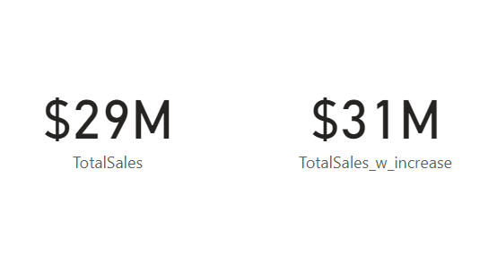

# Calculation Using Basic DAX

## What is DAX?

Data Analysis Expressions is a library of functions and operators that can be iused to build formulas and expressions in PowerBI.

## Using DAX to Calculate Key Insights

You will be using DAX to analyze sales data throughout the years for an automobile company.

### Steps followed

- Step 1 : Load 'Sales.xlsx' into your Power BI
- Step 2 : Your first step will be to calculate Profit from the sales column by Subtracting Line Cost from Line Price

        Profit = Sales[LinePrice]-Sales[LineCost]

  The newly calculated column should look like this:

  

- Step 3 : Now display Profit by Year through a Clustered Column Chart where Y axis is Profit and X axis is Year. Make sure to select the Sum of profits from the format visualization menu. The line chart should look like this.

  Now you know that in 2019 the profit was maximum.

  

- Step 4 : Now create a new measure Sales Count to calculate total number of individual orders using the function

        Sales Count = DISTINCTCOUNT(Sales[OrderNo])

- Step 5 : Showcase Sales Count with respect to Order Year Hierchy in a line chart that can drill down to different year, quarter and month, which would look like this:

  

- Step 6 : Create a new measure in Calculations to determine the Sum of profit, using the follwoing DAX

        TotalProfit = SUM(Sales[Profit])

- Step 7 : Now determine the Profit Margin Ratio with that, use the DIVIDE function:

        ProfitMarginRatio = DIVIDE([TotalProfit],[TotalSales])

- Step 8 : Plot Profit Margin Ratio by Year in a new line chart, which should look like:
  photo
- Step 9 : In a new page determine Total Sales after a 5% increase. Use a variable 'increase' and set its value to 0.05, the DAX should look like this:

        TotalSales_w_increase =
        VAR increase = 0.05
        RETURN '_Calculations'[TotalSales] + (_Calculations[TotalSales] * increase)

- Step 10 : Add 2 cards comparing Total Sales and Total Sales After Increase. Make sure to format them as Currency ($) and no decimal points. The cards should look like this:

  

- Step 11 : Now add another page to th report where you will be filtering calculation through functions. You will be calculating revenue generated by selling bikes in 2019.
- Step 12 : Create a new measure 2019 Bike revenue and calculate the sum of line price of bikes and put filers on bikes using the following DAX. Note: make sure to put the category names correctly.

        2019 Bike Revenue =
        CALCULATE(
        SUM(Sales[LinePrice]),
        Sales[ProductCategory] = "Bikes",
        YEAR(Sales[OrderDate]) = 2019
        )

- Step 13 : Display 2019 Bike Revenue in a card visual. It should look like this

  

- Step 14 : Let's use DATE function to determine the day of a specific date. Load up the Date.xlsx in PowerBI. Add a new page called date table.
- Step 15 : Create a new column 'DayNo'. Use the DAY() function the calculate the day number in the month. The dax should look like this

        DayNo = DAY('Date Table'[Date])

  The column should look like this:

  

- Step 16 : Create a new column 'DayShortName' that uses FORMAT() with dates to return 3 letter short name for days ("ddd"). The DAX should look like this

       DayShortName = FORMAT('Date Table'[Date], "ddd")

  The column should look like this:

  

  Step 17 : Finally create a table that shows Date and DayShortName, which should look like this

  
